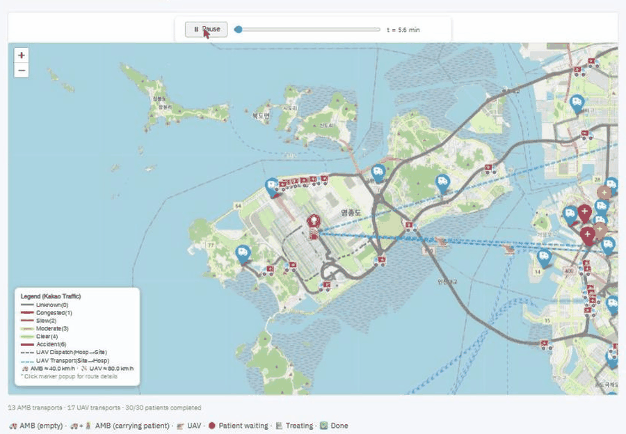
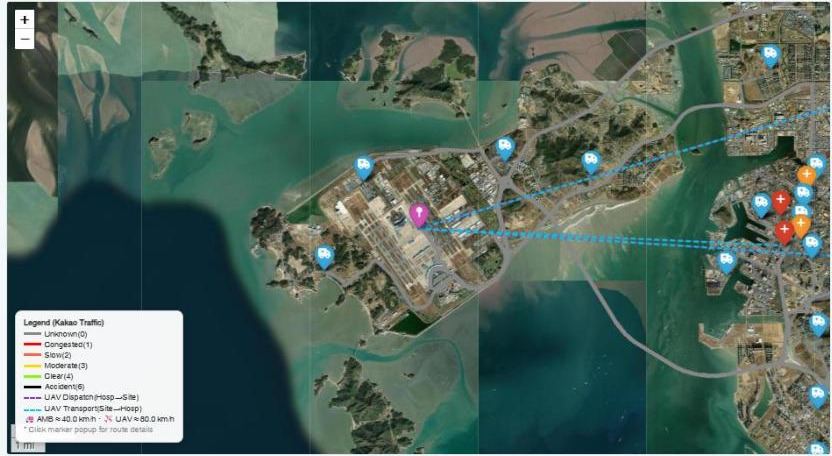
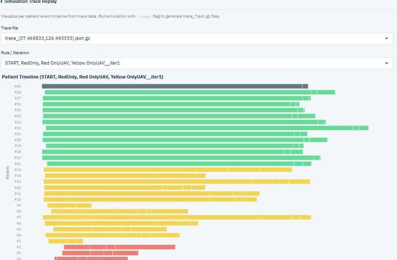
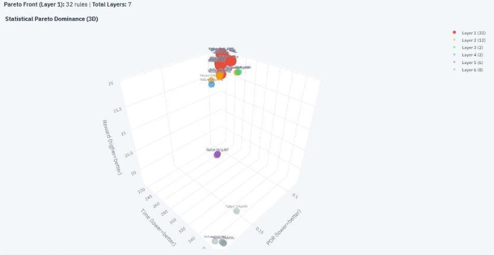
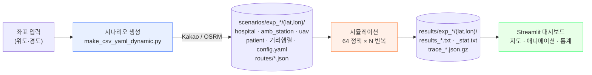

<div align="center">

# MCI_ADV

**대량 재난 사고(MCI) 환자 이송 정책 시뮬레이션 플랫폼**

구급차와 UAV를 함께 운용하는 64개 이송 정책을 실제 도로망 위에서 이산사건 시뮬레이션으로 실행하고,
생존확률·예방가능사망률·소요시간을 통계적으로 비교합니다.


[개요](#개요) · [시작하기](#시작하기) · [파이프라인](#파이프라인) · [주요 기능](#주요-기능) · [대시보드](#대시보드) · [출력 파일](#출력-파일) · [환경 변수](#환경-변수) · [상세 문서](#상세-문서)

</div>

<p align="center">

<br><sub>Maps · Animation — 시뮬레이션 trace를 실제 도로 경로 위에서 재생</sub>
</p>

<table>
<tr>
<td width="33%"></td>
<td width="33%"></td>
<td width="33%"></td>
</tr>
<tr>
<td align="center"><sub>Maps · Dark 테마 (Esri 위성 타일)</sub></td>
<td align="center"><sub>Scenarios · 환자별 Trace Replay</sub></td>
<td align="center"><sub>Analytics · Pareto Dominance (3D)</sub></td>
</tr>
</table>

---

## 개요

| 항목 | 내용 |
|---|---|
| 문제 | 재난 현장의 환자 N명을 어느 병원으로, 구급차와 UAV 중 어떤 수단으로 이송할 것인가 |
| 방법 | 이산사건 시뮬레이션 × 64개 정책 × 반복 시행. 모든 정책이 동일한 난수열(CRN)을 사용하므로 짝지은 비교가 가능 |
| 데이터 | 전국 병원·119 안전센터 좌표, 카카오 모빌리티 실시간 교통 또는 OSRM 도로망, 병원별 수술실·병상 용량 |
| 결과 | Streamlit 대시보드 — 지도 애니메이션, 환자별 간트차트, ANOVA·CLD·Pareto 분석, LaTeX 내보내기 |

---

## 시작하기

### 요구 사항

- Python 3.12 (numpy 2.4 이상은 Python 3.11 이상 필요)
- 라우팅 백엔드 (시나리오 생성 시)

| 백엔드 | 설정 | 특징 |
|---|---|---|
| 카카오 모빌리티 (기본) | `KAKAO_API_KEY` 환경 변수 또는 `.streamlit/secrets.toml` | 실시간·미래 시각 교통 반영 |
| OSRM | 설정 없음 (공개 데모 서버) 또는 `MCI_OSRM_URL` | 정적 도로망, API 키 불필요 |

### 설치

```bash
git clone https://github.com/SDOlab/MCI_ADV.git && cd MCI_ADV
conda create -n MCI python=3.12 -y && conda activate MCI
pip install -r requirements.txt
```

### 실행

```bash
cd src/vis_src && streamlit run MCI_Streamlit.py
```

대시보드의 **Generate** 페이지에서 좌표와 파라미터를 입력하면 시나리오 생성과 시뮬레이션이 이어서 실행됩니다.

CLI 실행 예:

```bash
# 시나리오 생성 — 서울시청 좌표, 환자 30명, 구급차 30대, UAV 3대
python src/sce_src/make_csv_yaml_dynamic.py --base_path . \
  --latitude 37.5665 --longitude 126.9780 \
  --incident_size 30 --amb_count 30 --uav_count 3 --experiment_id demo

# 시뮬레이션 — 64개 정책 × 30회 반복, trace 저장
python src/sim_src/main.py \
  --config_path "scenarios/exp_demo/(37.5665,126.978)/config_(37.5665,126.978).yaml" --trace
```

실험 ID는 카카오 모드에서 출발 시각을 지정하면 `exp_<id>_dep_<YYYYMMDDHHMM>`, OSRM 모드에서는 `exp_<id>_osrm` 형식으로 저장됩니다.

---

## 파이프라인



| 단계 | 모듈 | 산출물 |
|---|---|---|
| 시나리오 생성 | `src/sce_src/make_csv_yaml_dynamic.py` | 병원·안전센터·UAV·환자 CSV, 병원 간 거리행렬, `config_(lat,lon).yaml`, 경로 JSON |
| 오케스트레이션 | `src/sce_src/orchestrator.py` | 생성·시뮬레이션 서브프로세스 관리, 요약 CSV, 실행 로그 |
| 시뮬레이션 | `src/sim_src/main.py` (고속 경로 `src/sim_src_upgrade/` 자동 적용) | `results_*.txt`, `_stat.txt`, `trace_*.json.gz` |
| 시각화·분석 | `src/vis_src/MCI_Streamlit.py`, `pages/` | 지도·애니메이션·간트차트·통계 분석 |
| 배치 실험 | `experiment_1/batch_runner.py` | 다좌표 자동 실행, `progress.json` 기반 재개 |

---

## 주요 기능

### 실제 도로망 기반 시나리오 생성

전국 병원 마스터(요양기관·수술실수·병상수·헬기장 여부)와 119 안전센터 데이터에서 사고 좌표 주변의 자원을 자동 선정합니다.
병원은 누적 용량이 환자 수 × 버퍼비(기본 1.5)를 넘을 때까지 가까운 순으로 포함하고, 보장 규칙(상급종합 ≥ 2, 상급 용량 ≥ 40%,
종합 ≥ 1, 헬기장 ≥ UAV 대수, 헬기장∩상급 ≥ 1, 헬기장∩종합 ≥ 1)을 적용합니다.

- 구간별 원본 API 응답을 `routes/`에 보존하며, 지도 애니메이션은 이 폴리라인을 따릅니다.
- 도로 스냅에 실패한 좌표는 OSRM `/nearest`로 보정 후 재시도하고, 보정 내역을 `route_adjustments.json`에 기록합니다.

### 구급차 + UAV 이산사건 시뮬레이션

`heapq` 이벤트 큐가 구조 → 배차 → 이송 → 병원 도착 → 치료 → 완료를 분 단위로 진행합니다.

- UAV는 헬기장 보유 병원에만 착륙합니다.
- 병원 용량은 수술실수 + 병상수이며, 만원 시 다른 병원으로 전원(diversion)합니다.
- Green/Black 환자는 Red/Yellow 이송 완료 후 일괄 이송합니다.
- 이송 시간은 lognormal 분포에서 샘플링하며, 동일 시드에서 완전히 재현됩니다.

### 64개 정책 전수 비교

```
2 (Priority: START / ReSTART) × 2 (Hospital: RedOnly / YellowNearest)
× 4 (Red mode) × 4 (Yellow mode) = 64
```

### 통계 분석

RCBD / Reduced-Factorial ANOVA, EMM 사후검정 + Holm 보정, CLD(Piepho 2004), η²/ω² 효과크기,
잔차 진단(Shapiro-Wilk·Anderson-Darling·Levene·Tukey 비가법성), Pareto 지배 분석,
BCa 부트스트랩·Friedman·Kruskal-Wallis, 검정력 분석, LaTeX 내보내기를 지원합니다.

### 고속 실행 경로

`src/sim_src_upgrade/`는 `src/sim_src`와 로직이 동일한 별도 실행 경로입니다. 대시보드와 배치 실행은 추가 설정 없이 이 경로를 사용합니다.

| 항목 | 내용 |
|---|---|
| 결과 | `results_*.txt` · `_stat.txt` · `trace_*.json.gz` 원본과 바이트 단위 동일 (64정책 × 3반복 동치검증, 최대 절대차 0.0) |
| 속도 | 동일 프로세스 기준 2.8배. 기본 실행(64 정책 × 30회) 약 7초 |
| 안전장치 | 실행 전 G0 드리프트 검사(원본 해시). 불일치 시 원본 코어로 폴백 |
| 비활성화 | `MCI_FAST_CORE=0` |

<details>
<summary>최적화 범위와 검증 방법</summary>
<br>

변경한 것: 이송 중 카운트 `bincount` 처리, G/B 이송 후보 순서 시나리오당 1회 사전 계산, 종료·구조 판정 증분 카운터,
결합 mask 브로드캐스트, `patient_info` DataFrame 조회 제거.

변경하지 않은 것: 부동소수 연산 순서, `np.argsort`의 `kind`, `p_wait[...].pop()` 순서, RNG 호출 횟수와 순서.
이 중 하나라도 바뀌면 시뮬레이션 궤적이 달라집니다.

동치성은 매 실행의 G0 해시 검사(`origin_sync.py --check`)와 코어 수정 후 1회 실행하는 `verify/sim_equivalence.py`로 보장합니다.
실행마다 수행하던 소규모 사전점검은 2026-10부터 기본 생략하며, `run_simulation(skip_preflight=False)`로 다시 켤 수 있습니다.

상세: [`src/sim_src_upgrade/README.md`](src/sim_src_upgrade/README.md)

</details>

---

## 대시보드

```bash
cd src/vis_src && streamlit run MCI_Streamlit.py
```

사이드바에서 실험 ID와 좌표를 선택하면 모든 화면이 해당 좌표를 기준으로 동작합니다. 선택 상태는 URL 쿼리에 유지됩니다.

| 화면 | 기능 |
|---|---|
| **Maps** | 안전센터→현장, 현장→병원 경로를 혼잡도 색상으로 표시. Light(OpenStreetMap / Esri Gray)·Dark(Esri 위성) 타일. Animation 모드에서는 구급차·UAV 마커가 실제 도로 폴리라인을 따라 이동하며, 환자 마커 클릭 시 이송 수단·병원·대기·치료 시간 표시 |
| **Scenarios** | 실행 로그, 환자 요약표, 환자별 상태 변화 애니메이션, 전체 이벤트 표, Trace Replay 간트차트 |
| **Analytics** | RAW / STAT / ANOVA Suite / Pareto Dominance / Bootstrap·비모수 / Power Analysis / Export |
| **Data Tables** | 시나리오 CSV 편집(자동 백업) 후 수정값으로 재실행 |
| **Rerun** | 기존 YAML 기반 재실행. 반복 수, 차량 속도·인계 시간, duration 계수, 용량 계수 변경 |
| **Generate** (페이지) | 좌표·환자·차량 수·속도 입력 후 시나리오 생성 및 즉시 실행 |
| **ResultsCompare** (페이지) | 다좌표 결과 비교 — Composite Score, Kendall W, Forest plot, Rule × Location 교호작용 |
| **BatchExperiment** (페이지) | `experiment_1/` 배치 실험의 진행 상황·결과·보고서 열람 |

---

## 출력 파일

기본 실행(64 정책 × 30회 반복) 기준입니다.

| 파일 | 위치 | 크기 | 내용 |
|---|---|---|---|
| `results_(lat,lon).txt` | `results/<exp>/(lat,lon)/` | 약 200KB | 320행 = 64 정책 × 5 지표(Reward, Time, PDR, Reward w.o.G, PDR w.o.G), 열 = 반복 |
| `results_(lat,lon)_stat.txt` | 〃 | 약 40KB | 정책별 평균·표준편차·95% CI 반폭 |
| `trace_(lat,lon).json.gz` | 〃 | 약 2.5MB | 정책·반복별 이벤트 레코드. 이벤트당 한 줄이므로 `zcat … \| grep '"patient_id":7'`로 조회 가능 |
| `(lat,lon)_<ts>.txt` | `experiment_logs/` | 약 100KB | 실행 로그. 헤더 `=== SIM_START … trace_file=<경로>\|<bytes> ===`가 trace 파일을 가리킴 |
| `<exp>_summary.csv` | `scenarios/<exp>/` | — | 좌표별 생성·실행 요약 (Scenarios 화면의 Simulation Info) |

대시보드의 애니메이션·환자 요약·Trace Replay는 trace 파일을 사용합니다. stdout에 이벤트 튜플이 기록된 이전 형식의 로그도 그대로 파싱되므로
기존 결과는 계속 조회할 수 있습니다. `--trace` 없이 CLI로 실행할 때만 이벤트가 콘솔에 출력되며, 결과 파일은 두 경우 모두 동일합니다.

<details>
<summary>trace 레코드 종류</summary>
<br>

| event | 필드 | 의미 |
|---|---|---|
| `onset` | n_patients, severity_dist | 사고 발생, 중증도 분포 |
| `rescue` | patient_id, severity | 환자 구조 완료 |
| `vehicle_arrival_site` | vehicle, vehicle_id | 구급차·UAV 현장 도착 (최초 출동 및 복귀) |
| `transport_start` | patient_id, vehicle, vehicle_id, hospital_id, severity | 의사결정에 따른 이송 출발 (G/B 일괄 이송 제외) |
| `hospital_arrival` | patient_id, vehicle, vehicle_id, hospital_id, severity, admitted | 병원 도착 및 수용 |
| `diversion` | patient_id, vehicle, vehicle_id, from_hospital, to_hospital, severity | 만원으로 인한 전원 |
| `care_ready` | patient_id, hospital_id, severity | 인계 완료 (대기열 진입 포함) |
| `care_start` | patient_id, hospital_id, severity | 처치 시작 |
| `care_complete` | patient_id, hospital_id | 처치 완료 |

</details>

---

## 환경 변수

| 변수 | 기본값 | 설명 |
|---|---|---|
| `KAKAO_API_KEY` | — | 카카오 모빌리티 API 키. 대시보드는 `KAKAO_REST_API_KEY`와 `secrets.toml`도 인식 |
| `MCI_OSRM_URL` | 공개 데모 서버 | 자체 OSRM 인스턴스 주소 |
| `MCI_FAST_CORE` | `1` | `0`이면 고속 경로를 끄고 원본 `src/sim_src`로 실행 |
| `MCI_WRITE_RUN_LOG` | `1` | `0`이면 `experiment_logs/`에 실행 로그를 기록하지 않음. 대시보드가 이 로그로 trace를 찾으므로 기본값 유지 권장 |
| `MCI_TRACE_PRINT` | `1` | `0`이면 고속 코어가 `--trace` 없는 실행에서도 이벤트·Action 콘솔 출력을 생략. trace가 켜진 실행은 이 값과 무관하게 콘솔 출력 없음 |
| `MCI_CAP_GATE` | `occ` | 발송 용량 게이트. `psent`는 병원 실시간 정보 없이 현장 발송 수만 기준 |
| `MCI_MAX_SEND_COEFF` | `1,1` | `max_send = a·수술실수 + b·병상수` |
| `MCI_BUFFER_RATIO` | `1.5` | 병원 후보 풀 용량 버퍼 배수 |
| `MCI_CAPA_SCALE` | `1` | 병원 용량 배율 (실험용) |
| `MCI_INCIDENT_SIZE` / `MCI_AMB_NUM` / `MCI_UAV_NUM` | — | 시뮬레이션 시점의 환자·구급차·UAV 수 재정의 (실험용) |

시뮬레이션 자체 로그(`sim_*.log`)는 기본 비활성이며 `main.py --log`로 활성화합니다.

---

## 라우팅 백엔드

<details open>
<summary>카카오 모빌리티 (실시간·미래 시각 교통)</summary>
<br>

`--is_use_time True`(기본). 구간마다 길찾기 API를 호출해 실제 소요 시간을 받습니다. `--departure_time YYYYMMDDHHMM`을 지정하면
해당 시각의 예측 교통량이 반영됩니다. 키는 환경 변수, Streamlit `secrets.toml`, Generate 페이지 입력 중 하나로 설정합니다.

```toml
# .streamlit/secrets.toml
[kakao]
rest_api_key = "…"
```

</details>

<details>
<summary>OSRM (오픈소스, API 키 불필요)</summary>
<br>

`--is_use_time False`. 정적 도로망 기준이므로 교통 혼잡은 반영되지 않으며, 시뮬레이션은 `거리 ÷ 속도`로 이동 시간을 계산합니다.
공개 데모 서버는 소규모 테스트 용도이며, 대량 생성에는 자체 인스턴스를 권장합니다.

```bash
wget https://download.geofabrik.de/asia/south-korea-latest.osm.pbf
docker run -t -v "$(pwd):/data" osrm/osrm-backend osrm-extract -p /opt/car.lua /data/south-korea-latest.osm.pbf
docker run -t -v "$(pwd):/data" osrm/osrm-backend osrm-partition /data/south-korea-latest.osrm
docker run -t -v "$(pwd):/data" osrm/osrm-backend osrm-customize /data/south-korea-latest.osrm
docker run -d -p 5000:5000 -v "$(pwd):/data" osrm/osrm-backend osrm-routed --algorithm mld /data/south-korea-latest.osrm

export MCI_OSRM_URL=http://localhost:5000
python src/sce_src/make_csv_yaml_dynamic.py … --is_use_time false
```

OSRM 모드에서도 `duration`이 CSV에 저장되므로, 동일 시나리오에서 YAML의 `is_use_time`을 True로 바꾸면 OSRM 소요 시간 기반으로 재실행할 수 있습니다.
저장 JSON은 카카오와 동일한 `{meta, payload}` 구조이며 `meta.api_provider`로 구분합니다. OSRM은 혼잡도 정보가 없어 지도에 단색 폴리라인으로 표시됩니다.

</details>

---

## 저장소 구조

```
MCI_ADV/
├── src/
│   ├── sim_src/              # 시뮬레이션 엔진 (정본)
│   ├── sim_src_upgrade/      # 고속 실행 경로 (결과 동일) + 동치검증
│   ├── sce_src/              # 시나리오 생성기, 오케스트레이터
│   └── vis_src/              # Streamlit 대시보드 (MCI_Streamlit.py, pages/, _theme.py)
├── scenarios/                # 마스터 데이터(병원 xlsx, 안전센터 csv, 거리행렬) + 생성된 시나리오
├── results/                  # 시뮬레이션 결과 (git 제외)
├── experiment_logs/          # 실행 로그 (git 제외)
├── experiment_1/             # 다좌표 배치 실험 파이프라인 및 보고서
├── docs/                     # README 이미지, 대시보드 디자인 기록
├── SYNC_MCI_UAV.md           # 연구 저장소 MCI_UAV와의 시뮬레이션 정합성 기록
├── USER_MANUAL_KO.md / _EN   # 대시보드 사용자 매뉴얼
└── requirements.txt
```

---

## 상세 문서

<details>
<summary>디렉터리 구조 (전체)</summary>
<br>

```
MCI_ADV/
├── src/
│   ├── sce_src/
│   │   ├── orchestrator.py               # 생성·시뮬레이션 서브프로세스, 요약 CSV, 실행 로그
│   │   ├── make_csv_yaml_dynamic.py      # 시나리오 생성기 (Kakao / OSRM)
│   │   └── BatchLab.py                   # 배치 처리 대시보드 (실험용)
│   ├── sim_src/
│   │   ├── main.py                       # 진입점 (RunManager)
│   │   ├── ScenarioManager.py            # 시나리오 로드, 개체 초기화
│   │   ├── EntityManager.py              # 개체 상태
│   │   ├── EventManager.py               # 이벤트 큐, 시뮬레이션 루프, trace 기록
│   │   ├── RuleManager.py                # 64개 정책
│   │   ├── MCIEnvironment_gymnasium.py   # Gymnasium 환경 래퍼
│   │   ├── config.yaml                   # 설정 템플릿
│   │   └── event_info.json               # 이벤트 정의
│   ├── sim_src_upgrade/
│   │   ├── core/                         # 고속 코어 (원본과 동일 로직)
│   │   ├── drivers/run_sim_fast.py       # main.py를 고속 코어로 실행하는 런처
│   │   ├── verify/sim_equivalence.py     # 구·신 코어 동치검증
│   │   └── origin_sync.py                # G0 드리프트 게이트
│   └── vis_src/
│       ├── MCI_Streamlit.py              # 메인 대시보드
│       ├── _theme.py                     # 공용 테마·헬퍼
│       └── pages/
│           ├── Generate.py
│           ├── ResultsCompare.py
│           └── BatchExperiment.py
├── scenarios/
│   ├── 안전센터와 소방서.csv               # 소방서/119 안전센터 마스터 (필수)
│   ├── 엑셀 결합 데이터.xlsx               # 병원 마스터 (필수)
│   ├── DISTANCE_MATRIX_FINAL.xlsx         # 사전 계산 병원 간 거리행렬
│   └── exp_<id>[_dep_<ts>|_osrm]/
│       └── (lat,lon)/
│           ├── config_(lat,lon).yaml
│           ├── patient_info.csv           # 중증도 분포, 구조·치료 시간 파라미터
│           ├── hospital_info.csv          # 선정 병원 (용량, 헬기장, 도로 거리·시간)
│           ├── amb_station_info.csv       # 안전센터 (보유 대수, 도로 거리·시간)
│           ├── uav_info.csv               # UAV 출동 병원
│           ├── distance_Hos2Hos_euc.csv / _road.csv
│           ├── route_adjustments.json     # 도로 스냅 보정 기록
│           └── routes/center2site/, routes/hos2site/   # 경로 JSON
├── results/exp_*/(lat,lon)/
│   ├── results_(lat,lon).txt
│   ├── results_(lat,lon)_stat.txt
│   └── trace_(lat,lon).json.gz
├── experiment_logs/(lat,lon)_YYYYMMDD_HHMMSS.txt
├── experiment_1/
│   ├── generate_coords.py                # 한국 육지 좌표 N개 생성
│   ├── batch_runner.py                   # 생성 + 시뮬레이션 배치, progress.json 재개
│   ├── visualize_coords.py               # 지도·히스토그램·규칙 히트맵
│   ├── EXPERIMENT_REPORT.md / .pdf
│   └── ctprvn.shp / .shx / .dbf          # 행정구역 shapefile
├── docs/img/                             # README 이미지
├── docs/design/                          # 대시보드 디자인 시안
└── requirements.txt
```

2026-04 이전에 생성한 시나리오는 `hospital_info_road.csv`, `amb_info_road.csv`, `distance_Hos2Site_*.csv`로 파일이 분리되어 있습니다.
시뮬레이터는 YAML이 가리키는 파일을 읽으므로 이전 시나리오도 그대로 실행됩니다.

</details>

<details>
<summary>시뮬레이션 엔진 (클래스·이벤트·상태)</summary>
<br>

```
RunManager (main.py)
├── ScenarioManager
│   ├── EntityManager — en_status
│   │   ├── patient:   p_states, p_wait, p_sent
│   │   ├── hospital:  h_states (idle, queue, occupied)
│   │   ├── ambulance: amb_states, amb_wait
│   │   └── uav:       uav_states, uav_wait
│   └── EventManager — event_queue(heapq), time, trace_log
├── RuleManager — rules: 64 × Universal_Rule
└── MCIEnvironment_gymnasium (gym.Env)
    ├── action = (severity, hospital_idx, mode)
    ├── step() → (obs, reward, done, truncated, info)
    └── reward = Σ SurvivalProb(rescue_time, severity)
```

| 이벤트 | 개체 | 의사결정 시점 | 설명 |
|---|---|---|---|
| `onset` | patient | 아니오 | 사고 발생, 구조 이벤트 생성 |
| `p_rescue` | patient | 예 | 구조 완료, 이송 대기 |
| `amb_arrival_site` / `uav_arrival_site` | ambulance / uav | 예 | 현장 도착 |
| `amb_arrival_hospital` / `uav_arrival_hospital` | patient, vehicle, hospital | 아니오 | 병원 도착, 인계 또는 전원 |
| `p_care_ready` | patient, hospital | 아니오 | 인계 완료, 처치 또는 대기 |
| `p_def_care` | patient, hospital | 아니오 | 처치 완료 |

`EventManager.run_next`는 가장 이른 이벤트를 꺼내 시계를 진행하고 차량 잔여 시간을 갱신한 뒤 핸들러를 실행합니다.
의사결정 시점이면 정책에 행동을 요청하고, 그렇지 않으면 종료 조건(전원 처치 완료)을 확인합니다.

- 환자 `p_states[i] = [severity, rescued, moving, moved, cared]`, severity 0=Red 1=Yellow 2=Green 3=Black
- 병원 `h_states[h] = [n_idle, n_queue, n_occupied]`
- 차량 `amb_states[a]` / `uav_states[u] = [destination, time_to_arrival, severity_carrying]`

</details>

<details>
<summary>입력 파일</summary>
<br>

**마스터 데이터**

| 파일 | 인코딩 | 주요 컬럼 |
|---|---|---|
| `scenarios/안전센터와 소방서.csv` | CP949 | 지역명, 주소, y좌표(위도), x좌표(경도), 구분(소방서/119안전센터), 수량(보유 구급차) |
| `scenarios/엑셀 결합 데이터.xlsx` | UTF-8 | 요양기관명, 종별코드(1=상급종합, 11=종합, 21=병원), 응급실병상수, x좌표, y좌표, 헬기장 여부 |

**config_(lat,lon).yaml**

```yaml
entity_info:
  patient:
    incident_size: 30
    latitude: 37.465833
    longitude: 126.443333
    info_path: "<folder>/patient_info.csv"
  hospital:
    info_path: "<folder>/hospital_info.csv"
    dist_Hos2Hos_euc_info: "<folder>/distance_Hos2Hos_euc.csv"
    dist_Hos2Hos_road_info: "<folder>/distance_Hos2Hos_road.csv"
    max_send_coeff: [1, 1]          # max_send = a·수술실수 + b·병상수
  ambulance:
    dispatch_distance_info: "<folder>/amb_station_info.csv"
    velocity: 40                    # km/h
    handover_time: 0                # 분
    is_use_time: True               # True: API 소요 시간 / False: 거리 ÷ 속도
    road_provider: kakao            # kakao | osrm
  uav:
    dispatch_distance_info: "<folder>/uav_info.csv"
    velocity: 80
    handover_time: 0
    is_use_time: False              # UAV는 항상 직선거리 ÷ 속도
event_info_path: "./src/sim_src/event_info.json"
rule_info:
  isFullFactorial: True
  priority_rule: ["START", "ReSTART"]
  hos_select_rule: ["RedOnly", "YellowNearest"]
  red_mode_rule: ["OnlyUAV", "Both_UAVFirst", "Both_AMBFirst", "OnlyAMB"]
  yellow_mode_rule: ["OnlyUAV", "Both_UAVFirst", "Both_AMBFirst", "OnlyAMB"]
run_setting:
  totalSamples: 30
  random_seed: 0
  output_path: "./results/exp_…"
  exp_indicator: "(lat,lon)"
```

**patient_info.csv**

```csv
type,ratio,rescue_param_alpha,rescue_param_beta,treat_tier3,treat_tier2,treat_tier3_mean,treat_tier2_mean
Red,0.1,6,5,True,False,40,INF
Yellow,0.3,2,13,True,True,20,30
Green,0.5,1,22,True,True,10,15
Black,0.1,0,0,True,True,0,0
```

ratio의 합은 1입니다. 구조 시간은 베타분포(alpha, beta), 처치 시간은 지수분포(mean, 분)를 따르며, treat_tier3/2는 상급종합/일반병원 처치 가능 여부입니다.

**routes/*.json**

```json
{
  "meta": {
    "api_provider": "kakao", "route_type": "center2site", "source_index": 0,
    "name": "영등포소방서", "center": [126.9123, 37.5234], "site": [126.9456, 37.5567],
    "departure_time": "202502091030", "distance_km": 5.2, "duration_min": 8.5
  },
  "payload": { "kakao_response": { } }
}
```

</details>

<details>
<summary>API 호출 (카카오 · OSRM)</summary>
<br>

| 용도 | 엔드포인트 | 함수 |
|---|---|---|
| 역지오코딩 | `https://dapi.kakao.com/v2/local/geo/coord2address.json` | `orchestrator.reverse_geocode_kakao` |
| 도로 거리·시간 | `https://apis-navi.kakaomobility.com/v1/future/directions` (`priority=TIME`, `departure_time` 선택) | `make_csv_yaml_dynamic.get_road_distance_kakao` |
| OSRM 경로 | `{MCI_OSRM_URL}/route/v1/driving/{lon1},{lat1};{lon2},{lat2}?overview=full&geometries=geojson` | 〃 (`is_use_time=False`) |

오류 처리: 401은 키 확인 후 중단, 429는 2초 대기 후 최대 3회 재시도, 타임아웃(15초)은 직선거리(Haversine)로 대체합니다.
한 생성 프로세스 안에서는 `requests.Session`으로 연결을 재사용합니다.

</details>

<details>
<summary>정책 64개 — 정의와 명명 규칙</summary>
<br>

| 요소 | 값 | 의미 |
|---|---|---|
| Priority | `START` | 초기에 전체 환자 배정 계획 수립 |
| | `ReSTART` | 병원 도착마다 잔여 환자 기준 재배정. τ = 71 − 0.5·num_D·(θ_amb/K_amb + θ_uav/K_uav) |
| Hospital | `RedOnly` | Red는 상급종합만, Yellow는 일반병원만 |
| | `YellowNearest` | Red는 상급종합, Yellow는 등급과 무관하게 거리순 |
| Red / Yellow mode | `OnlyUAV` · `OnlyAMB` | 단일 수단 (없으면 대기) |
| | `Both_UAVFirst` · `Both_AMBFirst` | 우선 수단이 없으면 다른 수단 사용 |

명명 규칙: `{Priority}, {Hospital}, Red {RedMode}, Yellow {YellowMode}` — 예: `START, RedOnly, Red OnlyUAV, Yellow OnlyAMB`

</details>

<details>
<summary>평가 지표</summary>
<br>

| 지표 | 계산 | 방향 |
|---|---|---|
| Reward | Σ SurvivalProb(rescue_time, severity) | 높을수록 좋음 |
| Time | 마지막 환자 처치 완료 시각 | 낮을수록 좋음 |
| PDR | 1 − Reward / Preventable | 낮을수록 좋음 |
| Reward w.o.G | Green 기여분 제외 Reward | 높을수록 좋음 |
| PDR w.o.G | Green 제외 PDR | 낮을수록 좋음 |

생존확률은 구조 시각과 중증도의 함수이며, Red가 시간에 가장 민감하고 Black의 기여는 0입니다.

</details>

<details>
<summary>Analytics 화면 상세</summary>
<br>

- 설계: One-way `value ~ C(rule)`, RCBD `value ~ C(rule) + C(run)`, Reduced Factorial `C(run) + 주효과 4 + 2원 교호작용 6`
- 사후검정: RCBD/Factorial은 EMM pairwise t + Holm, One-way는 Games-Howell, pingouin 미설치 시 Welch t + Holm
- CLD: Piepho(2004) absorption. 효과크기 η², ω²
- 잔차 진단: Shapiro-Wilk, Anderson-Darling, QQ, Residuals vs Fitted, Levene(Brown-Forsythe), Tukey 1-df 비가법성
- 추천: Reward↑ ∩ Time↓ ∩ PDR↓에서 모두 'a' 그룹인 정책
- Pareto: CLD 기반 지배 관계, 비지배 정렬 Layer, 3D 산점도
- Bootstrap/비모수: BCa CI, Friedman + Conover, Kruskal-Wallis + Dunn
- Power: 사후 검정력, 목표 0.8에 필요한 n, 검정력 곡선
- Export: ANOVA·CLD 표 LaTeX(APA), 분석 번들 txt

RCBD/Factorial 설계는 각 run 안에서 64개 정책이 동일한 시드를 공유한다는 전제(CRN)를 사용합니다.

</details>

<details>
<summary>배치 실험 (experiment_1)</summary>
<br>

한국 육지 내 랜덤 좌표에 대해 생성 → 시뮬레이션 → 시각화를 자동으로 수행합니다. 상세: [`experiment_1/README.md`](experiment_1/README.md)

```bash
python experiment_1/generate_coords.py --n 1000 --seed 0            # coords_korea.csv
python experiment_1/batch_runner.py --kakao-api-key KEY --experiment-id exp_korea_random_1000   # progress.json 기반 재개
python experiment_1/visualize_coords.py                             # 지도·히스토그램·규칙 히트맵·주효과
```

`results_*_stat.txt`는 320행(64 정책 × 5 지표 블록)이며 각 행은 `rule_name mean std ci_half`입니다.

</details>

<details>
<summary>대시보드 개발 노트 (테마·성능 구조)</summary>
<br>

**테마.** 4개 페이지가 `src/vis_src/_theme.py` 하나에서 스타일을 받습니다. 색·반경·폰트는 `.streamlit/config.toml`
(저장소 루트와 `src/vis_src/` 두 곳, 동일 값 유지)이 정본이며 CSS는 config로 표현할 수 없는 부분만 담당합니다.
`PALETTE`는 folium/plotly 호출부가 참조하고, `TRIAGE` 색(Red/Yellow/Green/Black)은 데이터 표현에만 사용합니다.

```python
from _theme import inject_theme, page_header, kpi_row, triage_badges
inject_theme()                                           # st.set_page_config() 직후 1회
page_header("제목", fields={"EXP": exp, "COORD": coord})
kpi_row([("Rescues", 12), ("Transports", 9)])
```

| 용도 | 사용 | 사용하지 않음 |
|---|---|---|
| 모드 선택 | `st.segmented_control` | `st.radio(horizontal=True)` |
| KPI 행 | `kpi_row()` / `st.metric(border=True)` | 수동 카드 CSS |
| 아이콘 | `icon=":material/...:"` | 라벨 앞 이모지 |
| 화면 전환 | `st.segmented_control` + `if _view == ...` | `st.tabs` |
| 파일 읽기 | `@st.cache_data` + `file_sig(path)` | TTL 기반 무효화 |

**성능.** Streamlit은 위젯 하나가 바뀌어도 스크립트 전체를 다시 실행합니다.

- 최상위 5개 화면과 Analytics 7개 서브화면을 `segmented_control` + `if`로 분리해 선택된 화면만 실행합니다
  (`st.tabs`는 보이지 않는 탭 본문까지 실행합니다). 화면 간 지역변수 공유는 이 구조를 깨뜨립니다.
- 캐시 키는 경로 + `(mtime_ns, size)` 시그니처이며 내용이 바뀐 경우에만 다시 읽습니다.
  `st.cache_data`는 밑줄로 시작하는 인자를 해시에서 제외하므로 시그니처 인자 이름에 밑줄을 사용하지 않습니다.
- 로그 블록과 trace는 수십 MB이므로 `cache_resource`로 참조를 공유합니다. 소비자는 복사해서 사용하고 제자리 수정은 하지 않습니다.
- 사이드바 미니맵은 `st_folium(..., returned_objects=[])`로 두어 팬/줌마다 스크립트가 재실행되지 않게 합니다.
- 선택 상태(`exp`/`coord`/`view`)는 URL 쿼리로 왕복합니다.

남은 비용: Maps 화면은 재실행마다 folium 지도를 새로 생성합니다. 지도 HTML을 입력 키로 캐시하는 방식이 다음 개선 후보입니다.

</details>

<details>
<summary>배포 · 제약 사항</summary>
<br>

**Streamlit Cloud.** 저장소를 연결하고 Python 3.12를 선택한 뒤 secrets에 `[kakao] rest_api_key`를 설정합니다.
`requirements.txt`의 모든 핀은 PyPI에 존재합니다. 배포용 저장소를 따로 사용하는 경우 해당 저장소에도 push해야 반영됩니다.

**제약 사항.**
- 반복 101회 이상인 실행은 로그 뷰어를 비활성화합니다. trace 파일은 Trace Replay에서 계속 조회할 수 있습니다.
- 한글 파일명 CSV는 CP949이며, CSV 읽기는 UTF-8-sig → CP949 순으로 시도합니다.
- OSRM 공개 데모 서버는 소규모 테스트 용도입니다.
- 2026-08-13 시뮬레이션 정합성 동기화로 결과값이 변경되었습니다. 동기화 전후 수치를 혼용하지 않도록 주의하십시오. 상세: `SYNC_MCI_UAV.md` §2

</details>

---

## 참고 문서

| 문서 | 내용 |
|---|---|
| [`USER_MANUAL_KO.md`](USER_MANUAL_KO.md) / [`USER_MANUAL_EN.md`](USER_MANUAL_EN.md) | 대시보드 사용자 매뉴얼 |
| [`SYNC_MCI_UAV.md`](SYNC_MCI_UAV.md) | 연구 저장소 MCI_UAV와의 시뮬레이션 로직 정합성 기록 |
| [`src/sim_src_upgrade/README.md`](src/sim_src_upgrade/README.md) | 고속 실행 경로 설계·검증 |
| [`experiment_1/README.md`](experiment_1/README.md) · [`EXPERIMENT_REPORT.md`](experiment_1/EXPERIMENT_REPORT.md) | 배치 실험 사용법과 보고서 |
| [`CODE_REVIEW_REPORT.md`](CODE_REVIEW_REPORT.md) | 코드 리뷰 보고서 |

문의 및 제안: [GitHub Issues](https://github.com/SDOlab/MCI_ADV/issues)
