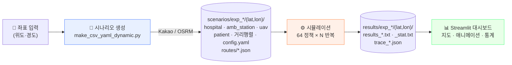

<div align="center">

# 🚑 MCI_ADV

**대량 재난 사고(Mass Casualty Incident) 환자 이송 최적화 시뮬레이션 플랫폼**

구급차(AMB)와 UAV를 함께 운용하는 **64개 이송 정책**을 실제 도로망 위에서 이벤트 기반으로
시뮬레이션하고, 통계적으로 비교해 최적 정책을 찾는다.


</div>

---

## 30초 요약

| | |
|---|---|
| **무엇을 푸나** | 재난 현장에 환자 N명. 어느 환자를, 어느 병원으로, 어떤 수단(AMB/UAV)으로 보낼 것인가 |
| **어떻게 푸나** | 이산사건 시뮬레이션 × 64개 정책 조합 × 반복 시행 → 생존확률·예방가능사망률로 비교 |
| **무엇이 현실적인가** | 실제 병원·안전센터 좌표, 카카오 모빌리티 실시간 교통시간 또는 OSRM 도로망, 병원별 수술실·병상 용량 |
| **결과를 어떻게 보나** | Streamlit 대시보드 — 지도 애니메이션, 환자별 간트차트, ANOVA·CLD·Pareto 통계 |

```bash
# 1) 환경
conda create -n MCI python=3.10 && conda activate MCI
pip install -r requirements.txt

# 2) 대시보드
cd src/vis_src && streamlit run MCI_Streamlit.py
```

> 시나리오 생성에는 **카카오 모빌리티 REST API 키**(실시간 교통) 또는 **OSRM 서버**(키 불필요)가 필요하다.
> 자세한 것은 아래 [라우팅 백엔드](#-라우팅-백엔드) 참조.

---

## 파이프라인



<details>
<summary><b>단계별 상세 — 어느 스크립트가 무엇을 만드나</b></summary>
<br>

| 단계 | 실행 주체 | 산출물 |
|---|---|---|
| 시나리오 생성 | `src/sce_src/make_csv_yaml_dynamic.py` | 병원·구급센터·UAV·환자 CSV, 병원간 거리행렬, `config_(lat,lon).yaml`, 경로 JSON(`routes/`) |
| 실행 오케스트레이션 | `src/sce_src/orchestrator.py` | 생성·시뮬 subprocess 관리, 요약 CSV, 실행 로그 |
| 시뮬레이션 | `src/sim_src/main.py` | `results_*.txt`(64룰 × 반복 × 5지표), `_stat.txt`(평균·표준편차·95%CI), `trace_*.json` |
| 시각화·분석 | `src/vis_src/MCI_Streamlit.py` | 지도·애니메이션·간트차트·ANOVA/CLD/Pareto |
| 배치 실험 | `experiment_1/batch_runner.py` | 다좌표 자동 실행 + `progress.json` 재개 |

</details>

---

## ✨ 기능

### 🗺️ 실제 도로망 기반 시나리오

전국 병원 마스터(요양기관·수술실수·병상수·헬기장 여부)와 119 안전센터 원장에서 사고 좌표 주변을
자동 선정한다. 병원은 **누적 용량이 환자 수 × 버퍼비를 넘을 때까지** 가까운 순으로 담고,
그 위에 보장 룰(상급종합 ≥2, 상급 용량 ≥40%, 종합 ≥1, 헬기장 ≥ UAV 대수, 헬기장∩상급 ≥1,
헬기장∩종합 ≥1)을 적용한다.

- **라우팅 2종**: 카카오 모빌리티(실시간·미래시각 교통) / OSRM(정적 도로망, 키 불필요)
- **경로 JSON 보존**: 모든 구간의 원 API 응답을 `routes/hos2site`·`routes/center2site` 에 저장 → 지도 애니메이션이 실제 도로 폴리라인을 따라간다
- **오지 좌표 구제**: 도로 스냅 실패 시 OSRM `/nearest` 로 스냅해 재시도, 그래도 안 되면 OSRM 라우팅 폴백. 스냅 이동거리는 `route_adjustments.json` 에 기록

### 🚁 AMB + UAV 이중 수단 시뮬레이션

이산사건 엔진(`heapq` 이벤트 큐)이 구조 → 배차 → 이송 → 병원 도착 → 치료 → 완료를 분 단위로 굴린다.
병원이 만원이면 **diversion**(뺑뺑이)이 발생하고, Green/Black은 R/Y 소진 후 일괄 이송된다.

- UAV는 **헬기장 보유 병원**에만 착륙 (하드 제약)
- 이송시간은 lognormal 샘플링 — 같은 시드면 완전 재현
- 병원 용량은 수술실수 + 병상수, 초과분은 대기열

### 🎯 64개 정책 전수 비교

```
2 (Priority) × 2 (Hospital) × 4 (Red mode) × 4 (Yellow mode) = 64
```

모든 정책이 **같은 시드**(CRN)를 공유하므로 반복 간 짝지은 비교가 성립한다.

### 📊 출판급 통계 분석

RCBD/Reduced-Factorial ANOVA, EMM 기반 사후검정 + Holm, **CLD(Piepho 2004)**, η²/ω² 효과크기,
잔차 진단(Shapiro-Wilk·Anderson-Darling·Levene·Tukey 비가법성), **Pareto 지배 분석**,
BCa 부트스트랩·Friedman·Kruskal-Wallis, 검정력 분석, LaTeX 내보내기.

### ⚡ 고속 실행경로 (자동 적용)

`src/sim_src_upgrade/` 는 `src/sim_src` 와 **로직이 동일한 별도 실행경로**다. 대시보드에서
시뮬을 돌리면 **별도 설정 없이 자동으로** 이 경로를 탄다.

| | |
|---|---|
| 결과 | `results_*.txt` · `_stat.txt` · `trace_*.json` **바이트 동일** |
| 속도 | 대시보드 경로 실측 **1.68×** (이벤트 로그 유지 시) / **1.99×** (`MCI_TRACE_PRINT=0`) |
| 안전장치 | 실행 전 **G0 드리프트 검사** + **구·신 코어 소규모 동치검증** 자동 수행, 불일치면 즉시 중단 |
| 끄기 | `MCI_FAST_CORE=0` |

<details>
<summary><b>무엇을 빠르게 만들었나 / 무엇은 일부러 안 건드렸나</b></summary>
<br>

바꾼 것: 이송중 카운트 `bincount` 화, G/B 이송 후보 순서 시나리오당 1회 사전계산,
종료·구조 판정 증분 카운터, 결합 mask 브로드캐스트, `patient_info` DataFrame 조회 제거,
이벤트별 디버그 `print` 게이트.

**일부러 안 건드린 것** — 부동소수 연산 순서, `np.argsort` 의 `kind`, `p_wait[...].pop()` 순서,
RNG 드로우의 수·순서. 하나라도 바뀌면 궤적이 갈려 비교가 무의미해진다.

> ⚠️ **이벤트 콘솔 출력은 기본 켬.** 대시보드가 `experiment_logs/` 의 이 출력을 파싱해
> Scenarios 탭·Maps Animation 을 그리기 때문이다. 순수 배치라면 `MCI_TRACE_PRINT=0` 으로
> 꺼서 더 빠르게 돌릴 수 있고, 출력 여부와 무관하게 결과 파일은 동일하다.

전체 문서 → **[`src/sim_src_upgrade/README.md`](src/sim_src_upgrade/README.md)**

</details>

---

## ⚙️ 실행 옵션

| 환경변수 | 기본 | 효과 |
|---|---|---|
| `MCI_FAST_CORE` | `1` | `0` 이면 고속경로를 끄고 원본 `src/sim_src` 로 실행 |
| `MCI_WRITE_RUN_LOG` | `1` | `0` 이면 `experiment_logs/` 에 실행 로그를 쓰지 않는다 (대시보드 Scenarios·Animation 탭이 이 로그를 읽으므로 기본 켬) |
| `MCI_TRACE_PRINT` | `1` | `0` 이면 고속 코어가 이벤트·Action 콘솔 출력을 생략한다(더 빠름, 대시보드 애니메이션 불가) |
| `MCI_OSRM_URL` | 공개 데모 서버 | 자체 OSRM 인스턴스 주소 |
| `KAKAO_API_KEY` | — | 카카오 모빌리티 키 (CLI 인자 미지정 시 자동 사용) |
| `MCI_CAP_GATE` | `occ` | 발송 용량 게이트. `psent` = 병원 실시간 정보 없이 현장 지득분만 |
| `MCI_MAX_SEND_COEFF` | `1,1` | `max_send = a·수술실수 + b·병상수` |
| `MCI_BUFFER_RATIO` | `1.5` | 병원 후보 풀 용량 버퍼 배수 |

**로그 정책**: 시뮬 자체 로그(`sim_*.log`)는 **기본 꺼짐**(`main.py --log` 로만 켬).
Orchestrator 의 실행 로그(`experiment_logs/<coord>_<ts>.txt`)는 대시보드가 경로를 표시하므로
기본 켜짐이고 `MCI_WRITE_RUN_LOG=0` 으로 끈다.

---

## 🧭 라우팅 백엔드

<details open>
<summary><b>카카오 모빌리티 (실시간·미래시각 교통)</b></summary>
<br>

`--is_use_time True`(기본). 시나리오 생성 시 구간마다 길찾기 API 를 호출해 **실제 소요시간**을 받는다.
`departure_time` 을 주면 미래 시각 기준 예측 교통량이 반영된다.
키는 `KAKAO_API_KEY` 환경변수, Streamlit `secrets.toml`, 또는 Generate 페이지 입력 중 하나로 준다.

</details>

<details>
<summary><b>OSRM (오픈소스, 키 불필요)</b></summary>
<br>

`--is_use_time False`. 정적 도로망 기반이라 교통 혼잡은 반영되지 않고, 시뮬은 `거리 ÷ 속도` 로
이동시간을 계산한다. 공개 데모 서버는 소규모 테스트 한정이며, 대량 생성은 자체 인스턴스를 띄운다.

```bash
docker run -d --name osrm -p 5000:5000 -v $PWD/osrm:/data \
  osrm/osrm-backend osrm-routed --algorithm mld /data/south-korea-latest.osrm
export MCI_OSRM_URL=http://localhost:5000
```

</details>

---

## 📁 저장소 구조

```
MCI_ADV/
├── src/
│   ├── sim_src/            # 시뮬레이션 엔진 (정본)
│   ├── sim_src_upgrade/    # ⚡ 고속 실행경로 (결과 동일)
│   ├── sce_src/            # 시나리오 생성기 + 오케스트레이터
│   └── vis_src/            # Streamlit 대시보드
├── scenarios/              # 마스터 데이터 + 생성된 시나리오
├── results/                # 시뮬레이션 결과
├── experiment_1/           # 다좌표 배치 실험 파이프라인
├── docs/design/            # 대시보드 디자인 시안·결정 기록
├── SYNC_MCI_UAV.md         # 연구 저장소(MCI_UAV)와의 시뮬 정합성 기록
└── requirements.txt
```


## 📚 상세 문서

필요한 것만 펼쳐 보면 된다.

<details>
<summary><b>📂 디렉토리 구조 (전체 트리)</b></summary>
<br>

```
MCI_ADV/
├── src/                                    # 소스 코드
│   ├── sce_src/                           # 시나리오 생성 모듈
│   │   ├── orchestrator.py               # 마스터 오케스트레이터
│   │   ├── make_csv_yaml_dynamic.py      # 동적 시나리오 생성기
│   │   └── BatchLab.py                   # 배치 처리 대시보드
│   │
│   ├── sim_src/                          # 시뮬레이션 엔진
│   │   ├── main.py                       # 시뮬레이션 진입점 (RunManager)
│   │   ├── ScenarioManager.py            # 시나리오 설정 및 개체 초기화
│   │   ├── EntityManager.py              # 개체 상태 관리
│   │   ├── EventManager.py               # 이벤트 큐 및 시뮬레이션 루프
│   │   ├── RuleManager.py                # 정책 규칙 관리 (64개 조합)
│   │   ├── MCIEnvironment_gymnasium.py   # Gymnasium 환경 래퍼
│   │   ├── config.yaml                   # 시뮬레이션 설정 템플릿
│   │   └── event_info.json               # 이벤트 정의 (8개 이벤트)
│   │
│   └── vis_src/                          # 시각화/대시보드
│       ├── MCI_Streamlit.py              # 메인 대시보드
│       ├── _theme.py                     # Dispatch Console 테마 (4개 페이지 공용)
│       └── pages/
│           ├── Generate.py               # 시나리오 생성 UI
│           ├── ResultsCompare.py         # 결과 비교 페이지
│           └── BatchExperiment.py        # 배치 실험 대시보드 (5단계 워크플로우)
│
├── scenarios/                             # 시나리오 데이터
│   ├── 안전센터와 소방서.csv               # 소방서/119안전센터 마스터 (필수)
│   ├── 엑셀 결합 데이터.xlsx               # 병원 마스터 데이터 (필수)
│   ├── DISTANCE_MATRIX_FINAL.xlsx         # 사전 계산된 거리 행렬
│   ├── label_map.csv                      # 실험 좌표 레이블
│   └── exp_{base}_dep_{HHMM}/  또는  exp_{base}_osrm/   # 생성된 시나리오 (Kakao=_dep_, OSRM=_osrm)
│       └── (lat,lon)/                     # 좌표별 폴더
│           ├── config_(lat,lon).yaml      # 시뮬레이션 설정
│           ├── patient_info.csv           # 환자 중증도 분포
│           ├── hospital_info_road.csv     # 병원 정보 (도로 거리)
│           ├── hospital_info_euc.csv      # 병원 정보 (직선 거리)
│           ├── amb_info_road.csv          # 구급차 출동 정보 (도로)
│           ├── amb_info_euc.csv           # 구급차 출동 정보 (직선)
│           ├── uav_info.csv               # UAV 출동 정보
│           ├── distance_Hos2Hos_*.csv     # 병원-병원 거리 행렬
│           ├── distance_Hos2Site_*.csv    # 병원-현장 거리 행렬
│           └── routes/                    # 경로 JSON
│               ├── center2site/           # 안전센터 → 사고지점
│               └── hos2site/              # 사고지점 → 병원
│
├── results/                               # 시뮬레이션 결과
│   └── exp_{base}_dep_{HHMM}/  또는  exp_{base}_osrm/
│       └── (lat,lon)/
│           ├── results_(lat,lon).txt      # RAW 결과 (전체 데이터)
│           └── results_(lat,lon)_stat.txt # 통계 요약
│
├── experiment_logs/                       # 실행 로그
│   └── (lat,lon)_YYYYMMDD_HHMMSS.txt     # 시나리오 생성(SCENARIO_GEN_START) 또는 시뮬레이션(SIM_START) 로그
│
├── experiment_1/                          # 논문 배치 실험 파이프라인
│   ├── generate_coords.py                # 한국 육지 좌표 1000개 생성
│   ├── batch_runner.py                   # 시나리오 생성 + 시뮬레이션 배치 처리
│   ├── visualize_coords.py               # 배치 결과 지도·히스토그램·규칙분석 시각화
│   └── ctprvn.shp / .shx / .dbf         # 한국 행정구역 shapefile
│
├── requirements.txt                       # Python 패키지 의존성
├── MCI_대시보드_관련_정보.pdf              # 대시보드 참고 문서
└── README.md                              # 본 문서
```

</details>

<details>
<summary><b>🔄 파이프라인 상세</b></summary>
<br>

전체 시스템은 3단계 파이프라인으로 구성됩니다:

```
┌──────────────────────────────────────────────────────────────────────────────┐
│                         1. 시나리오 생성 파이프라인                            │
├──────────────────────────────────────────────────────────────────────────────┤
│                                                                              │
│  사용자 입력 (Generate.py)                                                    │
│    ├─ 좌표 (위도, 경도)                                                       │
│    ├─ 환자 수, 구급차 수, UAV 수                                              │
│    ├─ 이동 속도 (AMB: 40km/h, UAV: 80km/h)                                   │
│    └─ 카카오 API 키 + 출발 시간                                               │
│                     ↓                                                        │
│  Orchestrator.generate_scenario()                                            │
│                     ↓                                                        │
│  ScenarioGenerator (make_csv_yaml_dynamic.py)                                │
│    ├─ 병원 마스터 데이터 로드 (엑셀 결합 데이터.xlsx)                          │
│    ├─ 소방서 데이터 로드 (안전센터와 소방서.csv)                               │
│    ├─ 카카오 모빌리티 API 호출 (도로 거리 + 소요 시간)                         │
│    ├─ patient_info.csv 생성 (중증도 분포)                                     │
│    ├─ hospital/ambulance/uav CSV 생성                                        │
│    ├─ 거리 행렬 생성 (Hos2Hos, Hos2Site)                                      │
│    ├─ routes/*.json 생성 (API 응답 저장)                                      │
│    └─ config_{coord}.yaml 생성                                               │
│                     ↓                                                        │
│  scenarios/exp_{base}_dep_{HHMM}/(lat,lon)/   또는   exp_{base}_osrm/...      │
│                                                                              │
└──────────────────────────────────────────────────────────────────────────────┘

┌──────────────────────────────────────────────────────────────────────────────┐
│                         2. 시뮬레이션 실행 파이프라인                          │
├──────────────────────────────────────────────────────────────────────────────┤
│                                                                              │
│  Orchestrator.run_simulation(config_path)                                    │
│                     ↓                                                        │
│  main.py --config_path config.yaml [--trace]                                 │
│                     ↓                                                        │
│  RunManager 초기화                                                            │
│    ├─ ScenarioManager: 개체 설정 로드 (환자, 병원, 구급차, UAV)                │
│    │     ├─ EntityManager: 개체 상태 관리                                     │
│    │     └─ EventManager: 이벤트 큐 관리                                      │
│    ├─ RuleManager: 64개 정책 규칙 생성 (Full Factorial)                       │
│    └─ MCIEnvironment_gymnasium: 시뮬레이션 환경 생성                          │
│                     ↓                                                        │
│  시뮬레이션 루프 (totalSamples × 64 rules)                                    │
│    ├─ env.reset() → 초기 관찰값                                               │
│    ├─ While not done:                                                        │
│    │     ├─ EventManager.run_next() → 이벤트 처리                             │
│    │     ├─ rule.select(observation) → 행동 선택                              │
│    │     └─ env.step(action) → 관찰값, 보상, 종료 여부                         │
│    └─ 결과 기록: [Reward, Time, PDR, Reward_woG, PDR_woG]                     │
│                     ↓                                                        │
│  results/exp_{...}/(lat,lon)/                                                │
│    ├─ results_(lat,lon).txt       (RAW 데이터)                               │
│    ├─ results_(lat,lon)_stat.txt  (통계: 평균, 표준편차, 95% CI)              │
│    └─ trace_(lat,lon).json        (환자별 트레이스, --trace 옵션 시)           │
│                                                                              │
└──────────────────────────────────────────────────────────────────────────────┘

┌──────────────────────────────────────────────────────────────────────────────┐
│                         3. 시각화 및 분석 파이프라인                           │
├──────────────────────────────────────────────────────────────────────────────┤
│                                                                              │
│  MCI_Streamlit.py 대시보드                                                    │
│    │                                                                         │
│    ├─ Settings (사이드바)                                                     │
│    │     ├─ 프로젝트 경로 선택                                                │
│    │     ├─ 실험 ID 선택                                                      │
│    │     ├─ 좌표 선택                                                         │
│    │     └─ 미니맵 표시                                                       │
│    │                                                                         │
│    ├─ Scenarios 탭                                                           │
│    │     ├─ experiment_logs 로그 뷰어                                        │
│    │     ├─ 환자별 구조→이송→치료 타임라인                                    │
│    │     ├─ 이벤트 테이블                                                     │
│    │     └─ Rule/Iteration 필터                                              │
│    │                                                                         │
│    ├─ Maps 탭                                                                │
│    │     ├─ Folium 지도 렌더링                                               │
│    │     ├─ C→S 경로 (안전센터 → 사고지점): 보라 점선                         │
│    │     ├─ S→H 경로 (사고지점 → 병원): 청록 점선                             │
│    │     ├─ 혼잡도 색상 표시                                                  │
│    │     └─ 경로 정보 팝업 (거리 km, 시간 min)                                │
│    │                                                                         │
│    ├─ Analytics 탭                                                           │
│    │     ├─ results_.txt 파싱                                                │
│    │     ├─ ANOVA 분석 (Full Factorial, One-way, RCBD)                       │
│    │     ├─ 사후검정 (EMM t-test/Holm for RCBD, Games-Howell for One-way)     │
│    │     ├─ 잔차 진단 (Shapiro-Wilk, QQ plot)                                │
│    │     └─ A그룹 교집합 추천                                                 │
│    │                                                                         │
│    ├─ Data Tables 탭                                                         │
│    │     ├─ CSV 파일 실시간 편집                                              │
│    │     ├─ 자동 백업                                                         │
│    │     └─ 수정값으로 재실행                                                 │
│    │                                                                         │
│    ├─ Rerun 탭                                                               │
│    │     └─ 기존 YAML 기반 시뮬레이션 재실행                                  │
│    │                                                                         │
│    ├─ ResultsCompare 페이지 (pages/ResultsCompare.py)                        │
│    │     ├─ 다수 좌표 간 결과 비교                                           │
│    │     ├─ Composite Score 및 Tier 분류                                     │
│    │     └─ Cross-Scenario Meta-Analysis                                     │
│    │           ├─ Kendall's W (순위 일치도)                                   │
│    │           ├─ Forest Plot (rule별 평균 ± CI across locations)             │
│    │           ├─ Stability Index (rule의 상위 유지율)                        │
│    │           └─ Rule × Location 교호작용 검정                               │
│    │                                                                         │
│    └─ Generate 페이지 (pages/Generate.py)                                    │
│          ├─ 카카오 API 키 입력                                                │
│          ├─ 운행시간 모드 (실시간/미래시간)                                    │
│          ├─ 파라미터 설정                                                     │
│          └─ 시나리오 생성 + 즉시 실행                                         │
│                                                                              │
└──────────────────────────────────────────────────────────────────────────────┘
```

</details>

<details>
<summary><b>🔗 모듈 간 Import 관계</b></summary>
<br>

#### 1. MCI_Streamlit.py (메인 대시보드)
```
MCI_Streamlit.py
    ↓ imports
    ├── orchestrator (src/sce_src)  ──→ Orchestrator 클래스
    ├── pandas, numpy, yaml         ──→ 데이터 I/O
    ├── streamlit, folium, altair   ──→ UI 렌더링
    ├── scipy, statsmodels          ──→ 통계 분석
    └── openpyxl                    ──→ 엑셀 파일 처리
```

#### 2. main.py (시뮬레이션 진입점)
```
main.py
    ↓ imports
    ├── ScenarioManager.py
    │     ├── EntityManager.py
    │     └── EventManager.py
    ├── RuleManager.py              ──→ Universal_Rule 클래스 (64개)
    ├── MCIEnvironment_gymnasium.py ──→ gymnasium.Env
    ├── yaml, argparse              ──→ 설정 파싱
    └── numpy, scipy                ──→ 수치 계산
```

#### 3. orchestrator.py (오케스트레이터)
```
orchestrator.py
    ↓ imports
    ├── make_csv_yaml_dynamic.py    ──→ ScenarioGenerator 클래스
    ├── subprocess                  ──→ main.py 실행
    ├── requests                    ──→ 카카오 API 호출
    ├── pandas, yaml                ──→ 데이터 처리
    └── time, datetime              ──→ 로깅
```

#### 4. make_csv_yaml_dynamic.py (시나리오 생성기)
```
make_csv_yaml_dynamic.py
    ↓ imports
    ├── requests                    ──→ 카카오 모빌리티 API
    ├── haversine                   ──→ 직선 거리 계산 (폴백)
    ├── pandas                      ──→ Excel/CSV I/O
    └── yaml, json                  ──→ 설정 파일 생성
```

</details>

<details>
<summary><b>🧩 시뮬레이션 엔진 아키텍처 (클래스·이벤트·상태)</b></summary>
<br>

#### 클래스 계층 구조

```
RunManager (main.py)
│
├── config ← YAML 설정 파싱
│
├── ScenarioManager
│   │
│   ├── EntityManager
│   │   └── en_status: dict  ← 개체 상태
│   │       ├── patient: p_states, p_wait, p_sent
│   │       ├── hospital: h_states (idle, queue, occupied)
│   │       ├── ambulance: amb_states, amb_wait
│   │       └── uav: uav_states, uav_wait
│   │
│   └── EventManager
│       ├── event_queue: heapq  ← 우선순위 큐 (시간순)
│       ├── events: onset, p_rescue, amb_arrival_site, ...
│       ├── time: 시뮬레이션 시계
│       ├── enable_trace: bool  ← --trace 플래그 시 활성화
│       ├── trace_log: list     ← 환자별 이벤트 기록
│       └── get_trace(): dict   ← 트레이스 데이터 반환
│
├── RuleManager
│   └── rules: List[Universal_Rule]  ← 64개 정책 조합
│       └── 결정 요소:
│           ├── Priority: START vs ReSTART
│           ├── Hospital Selection: RedOnly vs YellowNearest
│           ├── Red Action: OnlyUAV, Both_UAVFirst, Both_AMBFirst, OnlyAMB
│           └── Yellow Action: OnlyUAV, Both_UAVFirst, Both_AMBFirst, OnlyAMB
│
└── MCIEnvironment_gymnasium (gym.Env)
    ├── action_space: (patient_severity, hospital_idx, transport_mode)
    ├── observation_space: 개체 상태
    ├── step(): 행동 실행 → (obs, reward, done, truncated, info)
    ├── reset(): 시나리오 초기화
    └── Reward = Σ[Patient_i: SurvivalProb(rescue_time, severity)]
```

#### 이벤트 흐름 (event_info.json)

| 이벤트 | 참여 개체 | Decision Epoch | 설명 |
|--------|----------|----------------|------|
| `onset` | patient | No | 사고 발생, 환자 구조 이벤트 생성 |
| `p_rescue` | patient | **Yes** | 환자 구조 완료, 이송 대기 시작 |
| `amb_arrival_site` | ambulance | **Yes** | 구급차 현장 도착 |
| `uav_arrival_site` | uav | **Yes** | UAV 현장 도착 |
| `amb_arrival_hospital` | patient, ambulance, hospital | No | 구급차 병원 도착, 환자 인계 |
| `uav_arrival_hospital` | patient, uav, hospital | No | UAV 병원 도착, 환자 인계 |
| `p_care_ready` | patient, hospital | No | 환자 치료 준비 완료 |
| `p_def_care` | patient, hospital | No | 환자 치료 완료 |

#### 시뮬레이션 루프 (EventManager.run_next)

```python
While True:
    1. event_queue에서 가장 빠른 이벤트 팝
    2. 시뮬레이션 시계 진행
    3. 자원 상태 업데이트 (구급차/UAV 이동 시간)
    4. 이벤트 핸들러 실행 (ev_onset, ev_p_rescue, ...)
    5. decision_epoch=True 이면: 정책에 행동 요청
    6. 종료 조건 확인 (모든 환자 치료 완료)
    7. 계속 진행
```

#### 개체 상태 구조

**환자 상태**: `p_states[patient_id] = [severity_class, rescued, moving, moved, cared]`
- severity_class: 0=Red, 1=Yellow, 2=Green, 3=Black
- rescued: 0=미구조, 1=구조 완료
- moving: 0=대기 중, 1=이송 중
- moved: 0=현장, 1=병원 도착
- cared: 0=미치료, 1=치료 시작, 2=치료 완료

**병원 상태**: `h_states[hospital_id] = [n_idle, n_queue, n_occupied]`
- n_idle: 가용 병상 수
- n_queue: 대기 환자 수
- n_occupied: 점유 병상 수

**구급차 상태**: `amb_states[amb_id] = [destination_hospital_id, severity_carrying, time_to_arrival]`

**UAV 상태**: `uav_states[uav_id] = [destination_hospital_id, severity_carrying, time_to_arrival]`

</details>

<details>
<summary><b>📄 입력 파일 구조 (마스터 데이터 · 생성 시나리오)</b></summary>
<br>

#### 1. 마스터 데이터

##### 안전센터와 소방서.csv (필수)
```
경로: scenarios/안전센터와 소방서.csv
인코딩: CP949

컬럼:
- 지역명: 시도명
- 지역번호: 지역 코드
- 주소: 상세 주소
- y좌표: 위도 (latitude)
- x좌표: 경도 (longitude)
- 전화번호: 연락처
- 구분: 소방서/119안전센터
- 날짜: 데이터 기준일
- 순번: 일련번호
- 수량: 보유 구급차 대수 (복제 기준)
```

##### 엑셀 결합 데이터.xlsx (필수)
```
경로: scenarios/엑셀 결합 데이터.xlsx
인코딩: UTF-8 (openpyxl)

컬럼:
- 요양기관명: 병원명
- 종별코드: 1=상급종합, 11=종합, 21=병원, ...
- 응급실병상수: 응급실 병상 수
- x좌표: 경도 (longitude)
- y좌표: 위도 (latitude)
- 헬기장 여부: 1=있음, 0=없음 (UAV 착륙 가능 여부)
```

#### 2. 생성된 시나리오 파일

##### config_(lat,lon).yaml
```yaml
entity_info:
  patient:
    incident_size: 30              # 총 환자 수
    latitude: 37.465833            # 사고지점 위도
    longitude: 126.443333          # 사고지점 경도
    incident_type: null            # 사고 유형 (확장용)
    info_path: "./patient_info.csv"

  hospital:
    load_data: True
    info_path: "./hospital_info_road.csv"
    dist_Hos2Hos_euc_info: "./distance_Hos2Hos_euc.csv"
    dist_Hos2Hos_road_info: "./distance_Hos2Hos_road.csv"
    dist_Hos2Site_euc_info: "./distance_Hos2Site_euc.csv"
    dist_Hos2Site_road_info: "./distance_Hos2Site_road.csv"
    max_send_coeff: [1, 1]         # max_send = a*capa + b*queue

  ambulance:
    load_data: True
    dispatch_distance_info: "./amb_info_road.csv"
    velocity: 40                   # km/h
    handover_time: 0               # 환자 인계 시간 (분)
    is_use_time: True              # True: 카카오 API duration / False: OSRM 정적거리(distance/velocity)
    duration_coeff: 1.0            # duration 가중치
    road_provider: kakao           # 시나리오 생성 시 사용된 도로 데이터 공급자 (kakao | osrm)

  uav:
    load_data: True
    dispatch_distance_info: "./uav_info.csv"
    velocity: 80                   # km/h
    handover_time: 0               # 환자 인계 시간 (분)

event_info_path: "event_info.json"

rule_info:
  isFullFactorial: True            # 64개 전체 조합
  priority_rule: ["START", "ReSTART"]
  hos_select_rule: ["RedOnly", "YellowNearest"]
  red_mode_rule: ["OnlyUAV", "Both_UAVFirst", "Both_AMBFirst", "OnlyAMB"]
  yellow_mode_rule: ["OnlyUAV", "Both_UAVFirst", "Both_AMBFirst", "OnlyAMB"]

run_setting:
  totalSamples: 30                 # 반복 횟수
  random_seed: 0                   # 랜덤 시드 (null=미고정)
  rule_test: True
  eval_mode: True
  output_path: "./results"
  exp_indicator: "(lat,lon)"       # 결과 파일 접미사
  save_info: True
```

##### patient_info.csv
```csv
type,ratio,rescue_param_alpha,rescue_param_beta,treat_tier3,treat_tier2,treat_tier3_mean,treat_tier2_mean
Red,0.1,6,5,True,False,40,INF
Yellow,0.3,2,13,True,True,20,30
Green,0.5,1,22,True,True,10,15
Black,0.1,0,0,True,True,0,0
```
- ratio: 환자 비율 (합계=1.0)
- rescue_param_alpha/beta: 구조 시간 베타 분포 파라미터
- treat_tier3: 상급종합병원(Tier3) 치료 가능 여부
- treat_tier2: 일반병원 치료 가능 여부
- treat_tier3/2_mean: 치료 시간 지수분포 평균 (분)

##### hospital_info_road.csv
```csv
Index,요양기관명,종별코드,응급실병상수,수술실수,병상수,헬기장 여부,x좌표,y좌표,distance,duration
0,서울대학교병원,1,50,3,47,1,126.9997,37.5795,15.3,28.5
1,연세대학교의과대학,1,45,3,42,1,126.9406,37.5622,12.1,22.3
...
```

##### amb_info_road.csv
```csv
Index,init_distance,duration,안전센터/소방서이름,보유대수
0,5.2,8.5,영등포소방서,3
1,6.8,11.2,구로119안전센터,2
...
```

##### uav_info.csv
```csv
Index,init_distance,hospital_name
0,15.3,서울대학교병원
1,12.1,연세대학교의과대학
...
```

##### routes/*.json (경로 데이터 — Kakao 또는 OSRM)
```json
{
  "meta": {
    "api_provider": "kakao",   // "kakao" 또는 "osrm"
    "route_type": "center2site",
    "source_index": 0,
    "name": "영등포소방서",
    "center": [126.9123, 37.5234],
    "site": [126.9456, 37.5567],
    "departure_time": "202502091030",
    "distance_km": 5.2,
    "duration_min": 8.5,
    "duration_sec": 510
  },
  "payload": {
    "kakao_response": { ... }
  }
}
```

</details>

<details>
<summary><b>🔌 API 사용 (카카오 · OSRM 설정)</b></summary>
<br>

#### 카카오 모빌리티 API

##### 역지오코딩 (좌표 → 주소)
```python
# orchestrator.py: reverse_geocode_kakao()
URL: https://dapi.kakao.com/v2/local/geo/coord2address.json
Headers: {"Authorization": "KakaoAK {API_KEY}"}
Params: {"x": lon, "y": lat, "input_coord": "WGS84"}

Response:
{
  "full_address": "서울특별시 영등포구 여의도동",
  "road_address": "서울특별시 영등포구 여의나루로 76",
  "area1": "서울특별시",
  "area2": "영등포구",
  "area3": "여의도동",
  "area4": ""
}
```

##### 도로 거리 및 소요 시간
```python
# make_csv_yaml_dynamic.py: get_road_distance_kakao()
URL: https://apis-navi.kakaomobility.com/v1/future/directions
Headers: {"Authorization": "KakaoAK {API_KEY}"}
Params: {
  "origin": "lon,lat",
  "destination": "lon,lat",
  "priority": "TIME",
  "departure_time": "YYYYMMDDHHMM"  # 미래시간 (선택)
}

Response:
{
  "routes": [{
    "summary": {
      "distance": 5200,      # 미터
      "duration": 510,       # 초
      "fare": {"toll": 0, "taxi": 3500}
    }
  }]
}
```

##### API 키 설정 방법
```python
# 1. Streamlit Cloud (secrets.toml)
[kakao]
rest_api_key = "your_api_key"

# 2. 환경 변수
export KAKAO_REST_API_KEY="your_api_key"

# 3. Generate.py UI 직접 입력
```

#### OSRM 백엔드 (오픈소스, 카카오 키 불필요)

카카오 모빌리티 API는 한국 한정 유료 서비스라 외부 사용자나 코드 리뷰어가 동일한 파이프라인을 그대로 돌리기 어렵다. 시나리오 최초 생성 시 `is_use_time=False`로 두면 카카오 대신 [OSRM](https://project-osrm.org/docs/v5.24.0/api/#) HTTP API로 도로 거리/시간을 받아 카카오와 **동일한 JSON·CSV·YAML 스키마**로 저장한다. 따라서 시뮬레이터/시각화 등 downstream은 그대로 동작한다.

```bash
# 카카오 키 없이 OSRM 데모 서버 사용 (소규모 테스트 한정)
python src/sce_src/make_csv_yaml_dynamic.py \
  --base_path . --latitude 37.5665 --longitude 126.9780 \
  --incident_size 30 --amb_count 30 --uav_count 3 \
  --is_use_time false --experiment_id osrm_demo
```

운영용으로는 자체 호스팅을 권장한다(데모 서버는 fair-use 정책이 있음):

```bash
# 한국 OSM 추출본 다운로드 후 1회 사전처리
wget https://download.geofabrik.de/asia/south-korea-latest.osm.pbf
docker run -t -v "$(pwd):/data" osrm/osrm-backend osrm-extract -p /opt/car.lua /data/south-korea-latest.osm.pbf
docker run -t -v "$(pwd):/data" osrm/osrm-backend osrm-partition  /data/south-korea-latest.osrm
docker run -t -v "$(pwd):/data" osrm/osrm-backend osrm-customize  /data/south-korea-latest.osrm
# 라우팅 서버 기동
docker run -t -i -p 5000:5000 -v "$(pwd):/data" osrm/osrm-backend \
  osrm-routed --algorithm mld /data/south-korea-latest.osrm

# 시나리오 생성 시 자체 OSRM 인스턴스 지정
export MCI_OSRM_URL=http://localhost:5000   # 또는 --osrm_url 인자
python src/sce_src/make_csv_yaml_dynamic.py ... --is_use_time false --osrm_url http://localhost:5000
```

`is_use_time=False` 모드에서도 OSRM duration이 CSV의 `duration` 컬럼에 함께 저장되므로, **동일 시나리오 폴더로 시뮬을 재실행할 때 YAML의 `is_use_time`을 True로 바꾸면** OSRM duration 기반 시뮬이 가능하다(분기 로직: `src/sim_src/ScenarioManager.py:191-212`). 첫 시뮬은 `distance/velocity` 분기로 동작한다.

##### OSRM 응답 매핑
```
GET {osrm_url}/route/v1/driving/{lon1},{lat1};{lon2},{lat2}
    ?overview=full&geometries=geojson&steps=false&annotations=false

routes[0].distance (m)         → distance_km = / 1000
routes[0].duration (s)         → duration_min = / 60
routes[0].geometry.coordinates → 지도 시각화용 폴리라인
```

저장되는 JSON은 카카오와 동일하게 `{meta, payload}` 구조이며, `meta.api_provider == "osrm"`, `payload.osrm_response`에 전체 응답이 들어간다. 대시보드 지도(`MCI_Streamlit.draw_route_from_json`)는 `api_provider`를 보고 카카오/OSRM 분기를 선택해 렌더링한다(OSRM은 혼잡도 데이터가 없으므로 단일 색 폴리라인).

##### 오류 처리
- **401 (Auth failure)**: API 키 확인 필요 → 중단
- **429 (Rate limit)**: 2초 대기 후 재시도 (최대 3회)
- **Timeout**: 15초 → 직선 거리(Haversine)로 폴백

</details>

<details>
<summary><b>🎯 정책 조합 64개 — 정의와 명명 규칙</b></summary>
<br>

```
2 (Priority) × 2 (Hospital Selection) × 4 (Red Action) × 4 (Yellow Action) = 64개
```

#### Priority (우선순위 정책)
| 값 | 설명 |
|----|------|
| START | 초기에 전체 환자 배정 계획 수립 |
| ReSTART | 병원 도착 시마다 잔여 환자 기반 재배정 (τ값 계산) |

ReSTART τ 계산:
```
τ = 71 - (0.5 × num_D × (θ_amb/K_amb + θ_uav/K_uav))
- num_D: 잔여 Yellow 환자 수
- θ: 평균 왕복 시간
- K: 이송 수단 수
```

#### Hospital Selection (병원 선택 정책)
| 값 | 설명 |
|----|------|
| RedOnly | Red 환자: 상급종합병원만, Yellow: 일반병원만 |
| YellowNearest | Red: 상급종합, Yellow: 거리순 (등급 무관) |

#### Red/Yellow Action (이송 수단 선택)
| 값 | 설명 |
|----|------|
| OnlyUAV | UAV만 사용 (없으면 대기) |
| OnlyAMB | 구급차만 사용 (없으면 대기) |
| Both_UAVFirst | UAV 우선, 없으면 구급차 |
| Both_AMBFirst | 구급차 우선, 없으면 UAV |

#### 시나리오 명명 규칙
```
{Priority}, {HosSelect}, Red {RedAction}, Yellow {YellowAction}

예시:
- START, RedOnly, Red OnlyUAV, Yellow OnlyAMB
- ReSTART, YellowNearest, Red Both_AMBFirst, Yellow Both_UAVFirst
```

</details>

<details>
<summary><b>🖥️ 대시보드 사용법 (탭별 기능 전체)</b></summary>
<br>

#### 실행 방법
```bash
# 메인 대시보드
cd src/vis_src
streamlit run MCI_Streamlit.py

# 시나리오 생성 페이지 (독립 실행)
streamlit run pages/Generate.py
```

#### 테마 (Dispatch Console)

대시보드 4개 페이지는 `src/vis_src/_theme.py` 하나에서 스타일을 받는다. 예전에는 각
페이지가 자기 `<style>` 블록을 따로 들고 있어 서로 어긋났고, 메인 대시보드만 제대로
스킨이 적용돼 있었다.

- 색을 바꾸려면 `_theme.py` 의 `PALETTE` 를 고친다. 여기가 정본이다.
- Streamlit 이 자체 렌더링해서 CSS 가 닿지 않는 위젯(데이터프레임 캔버스, 슬라이더,
  토스트)은 `.streamlit/config.toml` 이 담당한다. 저장소 루트와 `src/vis_src/` 두 곳에
  있고 **항상 같은 값을 유지**해야 한다.
- `TRIAGE` 색(Red/Yellow/Green/Black)은 START 분류 프로토콜 색이라 데이터 표현에만
  쓴다. 버튼·강조·테두리 같은 장식에 쓰지 않는다.
- 시안 3종 비교 문서: `docs/design/dashboard_redesign_pitch.html`

```python
from _theme import inject_theme, page_header

inject_theme()                       # st.set_page_config() 직후 1회
page_header("제목", "부제 <b>강조</b>")   # 콘솔 헤더 (선택)
```

#### 탭별 기능

##### 1. Settings (사이드바)
- **프로젝트 경로**: `C:\Users\User\MCI_ADV` 입력
- **실험 ID 선택**: `exp_<base>_dep_<HHMM>` (Kakao 모드) 또는 `exp_<base>_osrm` (OSRM 모드) 드롭다운
- **좌표 선택**: `(lat,lon)` 드롭다운
- **미니맵**: 선택된 좌표 위치 표시

##### 2. Scenarios 탭
- 로그 파일 선택 (experiment_logs/)
- **Rule 선택**: 64개 정책 중 선택
- **Iteration 선택**: 반복 횟수 중 선택
- **환자 요약표**: 구조시각 → 이송수단 → 병원 → 도착시각 → 치료완료
- **이벤트 테이블**: 전체 시뮬레이션 이벤트 타임라인
- **Patient Story Animation**: 환자별 상태 변화를 시간축 위에 색상 바로 시각화 (Waiting → Rescued → Transport → Hospital → Completed)
- **Simulation Trace Replay**: per-patient Gantt chart (`trace_*.json` — Orchestrator 가 **항상 생성**한다. CLI 직접 실행 시에만 `--trace` 필요)
  - 환자별 구조 → 이송 → 병원 도착 → 치료 시작 → 완료까지 타임라인
  - 중증도별 색상 구분 (Red/Yellow/Green/Black)
  - 이벤트 요약 통계 (Rescues, Transports, Arrivals, Diversions, Completed)

##### 3. Maps 탭
- **모드 전환**: Static Map / Animation 라디오 버튼
- **Static Map 모드**:
  - **테마**: Light / Dark
  - **경로 표시**:
    - AMB C→S (안전센터 → 사고지점): 실선, 혼잡도 색상
    - AMB S→H (사고지점 → 병원): 실선
    - UAV 출동: 점선 (상급종합병원 → 사고지점)
    - UAV 이송: 점선 (사고지점 → 병원)
  - **범례**: 혼잡도 색상 + AMB/UAV 속도 표시
  - **팝업**: 클릭 시 거리(km), 시간(min) 표시
- **Animation 모드** (시뮬레이션 로그 기반):
  - 시뮬레이션 로그 파일 선택 (시나리오 생성 로그는 자동 제외)
  - Rule/Iteration 선택
  - **이모지 마커**: 🚑 AMB, 🚁 UAV, 🛑 대기 환자, 🏥 치료 중, ✅ 치료 완료
  - **실제 도로 경로**: route JSON 폴리라인을 따라 차량 이동
  - **환자 탑승 표시**: 환자 이송 중 빨간 글로우 + 🧑‍⚕️ 오버레이
  - **이동 방향 반영**: 경도 변화에 따라 이모지 좌우 반전
  - **환자 클릭 팝업**: 환자 마커 클릭 시 이송 수단, 병원명, ER 대기 시간, 치료 시간, 총 체류 시간 팝업 표시
  - **컨트롤 바** (지도 하단 외부): Play/Pause 버튼, Replay 버튼, 시간 슬라이더, 시간 표시
  - 확대/축소/팬 지원 (재생 중에도 가능)

##### 4. Analytics 탭
- **서브탭 구조**: RAW Data | STAT Summary | ANOVA Suite | Pareto Dominance | Bootstrap / Non-Parametric | Power Analysis | Export
- **지표 선택**: Reward, Time, PDR, Reward w.o.G, PDR w.o.G
- **정렬 기준**: Reward↓, PDR↑, Time↑
- **ANOVA 설계**:
  - One-way: `value ~ C(rule)` — 단일 요인
  - RCBD: `value ~ C(rule) + C(run)` — run을 블록으로 취급 (CRN 전제)
  - Reduced Factorial: `value ~ C(run) + 4 main effects + 6 two-way interactions` — 블록 포함
- **유의수준**: α = 0.001 ~ 0.1 (슬라이더)
- **사후검정**:
  - RCBD/Factorial: **EMM(Estimated Marginal Means)** 기반 pairwise t-test + Holm 보정 (모형 MS_residual 사용)
  - One-way: Games-Howell (이분산 로버스트)
  - Fallback: Pairwise Welch t-test + Holm 보정 (pingouin 미설치 시)
- **CLD(Compact Letter Display)**: Piepho(2004) absorption 알고리즘 — 다중 문자 부여 가능 (예: "ab")
- **효과크기**: η² (eta-squared), ω² (omega-squared, 편향보정)
- **잔차 진단**: Shapiro-Wilk + Anderson-Darling 정규성, QQ plot, 히스토그램, Residuals vs Fitted
- **등분산 검정**: Levene (Brown-Forsythe variant, center=median)
- **RCBD 가법성**: Tukey 1-df non-additivity test
- **A그룹 교집합**: Reward↑ ∩ Time↓ ∩ PDR↓ 에서 letter 'a' 포함 시나리오 추천
- **CRN 전제**: RCBD/Factorial 모드는 각 run 내 64개 rule이 동일 랜덤 시드를 공유한다고 가정
- **Pareto Dominance** (Multi-Objective Analysis):
  - 통계적 Pareto 효율성 분석: CLD 결과 기반 rule 간 지배 관계 판별
  - 비지배 정렬 (Pareto Layer): Layer 0 = 최적 프론트
  - 3D 산점도 (Reward × Time × PDR), Layer별 색상 구분
  - Dominance 카운트 테이블 (각 rule이 지배/피지배하는 rule 수)
- **Bootstrap / Non-Parametric** (정규성 위반 시 대안):
  - BCa Bootstrap CI (scipy.stats.bootstrap): 편향 보정 가속 신뢰구간
  - Friedman Test: RCBD 비모수 대안 + Conover 사후검정
  - Kruskal-Wallis: One-way 비모수 대안 + Dunn 사후검정
- **Power Analysis** (검정력 분석):
  - 사후 검정력: 관측된 효과크기(η²)와 MSE 기반
  - 사전 표본 크기 권장: 목표 검정력(0.8)에 필요한 n 계산
  - 검정력 곡선 그래프 (n vs power)
- **Export** (출판용 내보내기):
  - ANOVA 테이블 LaTeX 형식 (APA 스타일)
  - CLD 결과 LaTeX 테이블
  - 전체 분석 번들 다운로드 (.txt)

##### 5. Data Tables 탭
- CSV 파일 선택 (파일명만 표시, 경로 숨김)
- 실시간 편집 가능 (`안전센터와 소방서.csv` 제외)
- 저장 시 자동 백업: `*_backup_{timestamp}.csv`
- "수정값으로 재실행" 버튼

##### 6. Rerun 탭
- 기존 YAML 설정 파일 선택
- 시뮬레이션 재실행

##### 7. Generate 페이지 (pages/Generate.py)
1. **카카오 API 키 입력**
2. **운행시간 모드 선택**:
   - 실시간: 현재 교통 상황 반영
   - 미래시간: YYYYMMDDHHMM 형식 입력
3. **파라미터 설정**:
   - 위도/경도
   - 환자 수 (기본: 30)
   - 구급차 수 (기본: 30)
   - UAV 수 (기본: 3)
   - 구급차 속도 (기본: 40 km/h)
   - UAV 속도 (기본: 80 km/h)
   - 시뮬레이션 반복 (기본: 10)
   - 랜덤 시드 (기본: 0)
4. **생성 및 실행**: 시나리오 생성 후 자동으로 시뮬레이션 실행

</details>

<details>
<summary><b>📐 평가 지표와 생존확률 모델</b></summary>
<br>

| 지표 | 계산 방법 | 해석 |
|------|----------|------|
| **Reward** | Σ SurvivalProb(rescue_time, severity) | 생존확률 합계 (↑ 좋음) |
| **Time** | 마지막 환자 치료 완료 시각 | 총 소요 시간 (↓ 좋음) |
| **PDR** | 1 - Reward / Preventable | 예방가능사망률 (↓ 좋음) |
| **Reward w.o.G** | Reward - Green 환자 기여분 | Green 제외 보상 (↑ 좋음) |
| **PDR w.o.G** | 1 - (Reward - Green) / (Preventable - Green) | Green 제외 PDR (↓ 좋음) |

#### 생존확률 계산
```
SurvivalProb = f(rescue_time, severity_class)
- Red: 시간에 민감 (빠른 이송 필수)
- Yellow: 중간 민감도
- Green: 시간 영향 적음
- Black: 사망 (기여분 0)
```

</details>

<details>
<summary><b>🧪 배치 실험 파이프라인 (experiment_1)</b></summary>
<br>

논문 실험용 배치 자동화 워크플로우입니다. 한국 육지 경계 내 랜덤 좌표 1000개에 대해 시나리오 생성 → 시뮬레이션 → 결과 시각화를 자동으로 처리합니다. 상세 사용법은 [`experiment_1/README.md`](experiment_1/README.md)를 참조하세요.

#### 전체 흐름

```
Step 1. 좌표 생성
  python experiment_1/generate_coords.py --n 1000 --seed 0
  → experiment_1/coords_korea.csv (1000개 한국 육지 좌표)

Step 2. 배치 실험 (매일 동일 명령 실행, progress.json에서 자동 이어서 처리)
  python experiment_1/batch_runner.py --kakao-api-key YOUR_KEY --experiment-id exp_korea_random_1000

Step 3. 결과 시각화
  python experiment_1/visualize_coords.py
  → scenarios/{experiment_id}/ 에 시각화 파일 생성
```

> 시각화 산출물(`coords_map.html`, 히스토그램, 규칙 히트맵, 주효과 그래프)은 `scenarios/{experiment_id}/` 폴더에 저장되며, 대시보드 BatchExperiment 페이지에서도 확인 가능합니다.

#### visualize_coords.py 기능

- **결과 지도 (단일 HTML)**: Reward / Time / PDR 3개 지표를 JavaScript 버튼으로 전환
- **지도 타일 전환**: OpenStreetMap / CartoDB 두 가지 타일 선택 가능
- **컬러맵**: RdYlGn (빨강↔초록), P5~P95 백분위수 클리핑으로 상대 비교 최적화
- **이상치 강조**: 상위·하위 N개 좌표를 별도 색상(파랑/보라)으로 표시
- **이상치 목록**: 접을 수 있는 `<details>` 패널로 좌표 및 인덱스 표시
- **히스토그램**: Freedman-Diaconis 빈 크기 (min 60, max 120개 빈), 이상치 빈 별도 색상, rug plot
- **규칙 히트맵**: 64개 규칙의 3지표 × 4패널(Priority×HosSelect) 매트릭스, 각 패널 4×4(Red Mode×Yellow Mode)
- **주효과 그래프**: 4개 요인별 marginal mean 막대그래프, Best level 빨간 테두리 + ★ 표시, Effect size 박스

```bash
python experiment_1/visualize_coords.py [옵션]
  --clip-pct FLOAT   컬러맵 클리핑 백분위수 (기본: 5.0 → 5th~95th)
  --outlier-n INT    양쪽 이상치 개수 (기본: 3)
  --out PATH         출력 HTML 경로 (기본: experiment_1/coords_map.html)
  --hist-format FMT  히스토그램 포맷 pdf|png (기본: pdf)
```

#### stat.txt 구조

시뮬레이션 결과 `results_*_stat.txt`는 320행 구성:
```
64룰 × 5블록 = 320행
블록 순서: Reward → Time → PDR → RewardWOG → PDRWOG
각 행: rule_name  mean  std  95%CI_half
시각화 값 = 블록별 64개 mean의 평균 (mean of means)
```

</details>

<details>
<summary><b>🛠️ 설치 및 실행 (상세)</b></summary>
<br>

#### 환경 요구사항
- Python 3.12 이상
- Windows / Linux / macOS

#### 설치
```bash
# 1. Conda 환경 생성 (권장)
conda create -n MCI python=3.12
conda activate MCI

# 2. 패키지 설치
pip install -r requirements.txt
```

#### 필수 파일 확인
```
scenarios/
├── 안전센터와 소방서.csv  ← 필수
└── 엑셀 결합 데이터.xlsx   ← 필수
```

#### 실행
```bash
# 1. 대시보드 실행
cd src/vis_src
streamlit run MCI_Streamlit.py

# 2. 시나리오 생성 페이지
streamlit run pages/Generate.py

# 3. 시뮬레이션 직접 실행 (CLI)
cd src/sim_src
python main.py --config_path /path/to/config.yaml

# 4. 시뮬레이션 + 환자별 트레이스 로깅 (대시보드 경로에서는 항상 켜짐)
cd src/sim_src
python main.py --config_path /path/to/config.yaml --trace
# → results/ 폴더에 trace_*.json 생성 (Scenarios 탭 Trace Replay에서 시각화)
```

#### Streamlit Cloud 배포
```
# 1. GitHub 저장소에 푸시
# 2. Streamlit Cloud에서 연결
# 3. secrets.toml 설정:
[kakao]
rest_api_key = "your_api_key"
```

</details>

<details>
<summary><b>📝 참고사항 · 알려진 제약</b></summary>
<br>

#### 성능
- 500회 초과 반복 시 로그 뷰어 자동 비활성화
- 대용량 데이터 처리 시 로딩 시간 증가 가능

#### 파일 인코딩
- 한글 파일명: CP949 인코딩 사용
- CSV 파일: UTF-8-sig → CP949 자동 폴백

#### 데이터 보호
- CSV 편집 시 자동 백업 생성
- 원본 데이터 보존

#### 확장 포인트
- `event_info.json`: 새로운 이벤트 타입 추가
- `RuleManager.py`: 새로운 정책 규칙 추가
- `make_csv_yaml_dynamic.py`: 새로운 데이터 소스 연동

</details>


---

## 🔗 관련 문서

| 문서 | 내용 |
|---|---|
| [`SYNC_MCI_UAV.md`](SYNC_MCI_UAV.md) | 연구 저장소 **MCI_UAV** 와의 시뮬 로직 정합성 기록 — 무엇을 맞췄고, 무엇을 이 저장소 고유로 남겼고, 그 결과 수치가 얼마나 바뀌었나 |
| [`src/sim_src_upgrade/README.md`](src/sim_src_upgrade/README.md) | 고속 실행경로 설계·검증·재검증 방법 |
| [`USER_MANUAL_KO.md`](USER_MANUAL_KO.md) / [`USER_MANUAL_EN.md`](USER_MANUAL_EN.md) | 대시보드 사용자 매뉴얼 |
| [`CODE_REVIEW_REPORT.md`](CODE_REVIEW_REPORT.md) | 코드 리뷰 보고서 |

> ⚠️ **수치 인용 주의**: 2026-08-13 시뮬 정합성 동기화로 결과값이 바뀌었다.
> 동기화 이전에 뽑은 수치와 이후 수치를 섞어 인용하면 안 된다. 상세는 `SYNC_MCI_UAV.md` §2.


## 라이선스

(프로젝트 라이선스 명시 필요)


## 문의

(문의처 정보 추가 필요)
